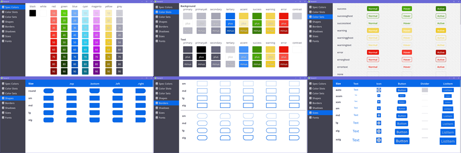

# Themed UI for QML

This is a part of [Node3D](https://github.com/node-3d) project.

[](https://badge.fury.io/js/qml-themedui-raub)

```console
npm i -s qml-themedui-raub
```



Web-like flex layout with themed colors, shapes, "shadows", fonts, etc.

## Features

* Global context to control themes and access utils.
* Containers behave similar to **flex** boxes in web.
* Themes are defined in JSON.
* Pluggable icon component.
* Basic components: `TuiText, TuiFlex, TuiIcon`.
* Extra components: `TuiButton, TuiListItem, TuiDivider`.


## Basic Components

```ts
TuiText {
	property int lines: 0 // if > 0, limit lines
	property string size: "md" // xxsm xsm sm md lg xlg xxlg
	property string fontName: "regular" // "regular" "semi" "bold" "mono"
	property string align: "left" // "left" | "right" | "center" | "justify"
	property string shadow: "none" // "none" | "sm" | "md"
	property int flex: 0 // -1 0 1 2 3...
	property string padding: "" // e.g: "", "10", "5 15", "20 10 5", "5 4 3 2"
	property string margin: "" // e.g: "", "10", "5 15", "20 10 5", "5 4 3 2"
	property var colors: "primarytext" // string | ColorSet
	property bool isDisabled: false
	property real opacityDisabled: 0.4
	property string state: "" // "hover" | "active" | ""
}
```

```ts
TuiFlex {
	property var abs: undefined // Item { anchors.fill: parent; ... }
	property real w: -1 // force width
	property real h: -1 // force height
	property string shape: "none" // "sm" | "md" | "lg" | "xlg" | "round" + [".top" | ".bottom" | ".left" | ".right"]
	property string border: "none" // "sm" | "md" | "lg" | "xlg"
	property string href: "" // string
	property string direction: "column" // "row" | "column" | "row-rtl" | "column-rtl"
	property string justify: "flex-start" // "flex-start" | "flex-end" | "center" | "stretch"
	property string align: "flex-start" // "flex-start" | "flex-end" | "center" | "stretch"
	property string shadow: "" // "none" | "sm" | "md" | "lg"
	property int flex: 0 // number
	property string padding: "" // css string
	property string margin: "" // css string
	property var colors: "none" // string | {}
	property bool isDisabled: false // boolean
	property real opacityDisabled: 0.4 // number
	property string state: "" // "hover" | "active" | ""
}
```

```ts
TuiIcon {
	// extends TuiFlex
	property int sizeIcon: 0 // icon size override, pixels
	property real rotation: 0
	property string name: "" // depends on user-provided icon set
	property string size: "md" // xxsm xsm sm md lg xlg xxlg (keyof TSpecSizes)
	property string shadowIcon: "none" // "none" | "sm" | "md"
}
```


## Pluggable Icons

This component library does not provide any icon glyphs. The user is expected to implement
an adapter to render glyphs.

```ts
// somewhere on startup
TuiContext.iconDelegate = Qt.createComponent("Icon.qml");
```

```ts
// Icon.qml
import ThemedUi
import FontAwesome

IconAwesome {
	property string shadow: "none"
	
	property var _shadowText: TuiContext.getShadowText(shadow)
	style: _shadowText ? _shadowText.style : Text.Normal
	styleColor: _shadowText ? _shadowText.styleColor : "#000000"
}
```

This would work with module `qml-fontawesome-raub` as per example.
Failing to set `iconDelegate` will result in all icons appearing as red boxes.

## Theming

```ts
// define a theme
import "themes/my-themes.js" as MyThemes

// somewhere on startup
TuiContext.theme = MyThemes.theme1;
```

### Theme structure:

```ts
{
	name: string,
	colors: {
		spec: { [id]: string },
		text: {
			primary: string,
			primaryplus: string,
			primaryminus: string,
			[id]: string,
		}, // TColorSlots
		bg: TColorSlots,
	},
	fonts: {
		regular: {
			family: string,
			weight: number,
		}, // TFont
		regular: TFont,
		[id]: TFont,
	},
	sizes: {
		font: {
			xxsm: number,
			xsm: number,
			sm: number,
			md: number,
			lg: number,
			xlg: number,
			xxlg: number,
			auto: number,
		}, // TSpecSizes
		button: TSpecSizes,
		icon: TSpecSizes,
		glyph: TSpecSizes,
		item: TSpecSizes,
		divider: TSpecSizes,
	},
	shadows: {
		none: null,
		sm: { size: number, color: '#55000000' }, // TBoxShadow | null
		md: TBoxShadow,
		lg: TBoxShadow,
	},
	shadowsText: {
		none: null,
		sm: { style: QtQuick.Text.Outline, styleColor: '#55000000' }, // TTextShadow | null
		md: TTextShadow,
	},
	shapes: {
		round: {
			all: [number, number, number, number],
			top: [number, number, 0, 0],
			bottom: [0, 0, number, number],
			left: [number, 0, 0, number],
			right: [0, number, number, 0],
		}, // TShapeRadii
		sm: TShapeRadii,
		md: TShapeRadii,
		lg: TShapeRadii,
		xlg: TShapeRadii,
	},
	borders: {
		sm: number,
		md: number,
		lg: number,
		xlg: number,
	},
	colorSets: {
		none: {
			text: TColorRef, // "spec.NAME" | "bg.NAME" | "text.NAME" | "#ff00ff" | "red"
			textHover: TColorRef,
			textActive: TColorRef,
			bg: TColorRef,
			bgHover: TColorRef,
			bgActive: TColorRef,
			border: TColorRef,
			borderHover: TColorRef,
			borderActive: TColorRef,
		}, // TColorSet
		primary: TColorSet,
		[id]: TColorSet,
	},
}
```


## TuiContext

This is a singleton, available after importing the module.


`TuiContext.themeUtils` - (readonly) helpers to create some theme-related items:
	```ts
	{
		hashIntoColor: (str: string) => string,
		createFlatColorset: (
			text: string, textHover: string, textActive: string, bg: string, bgHover: string, bgActive: string,
		) => TColorSet,
		createGhostColorset: (text: string, textHover: string, textActive: string) => TColorSet,
		createTextColorset: (text: string, textHover: string, textActive: string) => TColorSet,
		createStateColorsetTriplet: (name: keyof TColorSlots) => {
			`${name}`: TColorSet,
			`${name}ghost`: TColorSet,
			`${name}text`: TColorSet,
		}
		mapShapes: (sm, md, lg, xlg) => TShapeRadii,
		auxSides: (source: string) => [number, number, number, number]
	}
	```

`TuiContext.defaultTheme` - (readonly) the default theme object that may be used
to inherit some of the fields.

`TuiContext.theme` - assign your theme object here.
The initial value is `TuiContext.defaultTheme`.

`TuiContext.iconDelegate` - assign your icon adapter (component) here.
The initial value is `FakeIcon {}` (red box).

```ts
TuiContext.getShape(name: string): TShapeRadii | null;
TuiContext.getBorder(name): number | null;
TuiContext.getSize(name, prefix): number;
TuiContext.getFont(name): TFont | null;
TuiContext.getShadow(name): TBoxShadow | null;
TuiContext.getShadowText(name): TTextShadow | null;
TuiContext.getColor(name): string;
TuiContext.getColorBg(state, colors): string;
TuiContext.getColorText(state, colors): string;
TuiContext.getColorBorder(state, colors): string;
```


## Extra Components

```ts
TuiDivider {
	// extends TuiFlex
	property string size: "sm"
	property bool isVertical: false
}
```

```ts
TuiButton {
	// extends TuiFlex
	
	signal pressed(name: string)
	signal clicked(name: string)
	
	property string name: ""
	property string size: "md"
	property string sizeText: ""
	property string sizeIcons: "md"
	property var icons: null
	property var iconsActive: null
	property string label: ""
	property string labelActive: ""
	property int lines: 0
	property string fontName: "semi"
	property string fontActive: ""
	property int flexText: 0
	property string alignText: ""
	property string shadowText: ""
	property var colorsActive: null
	property bool isActive: false
	property bool isPressable: true
}
```

```ts
TuiListItem {
	// extends Button, but:
	
	// fontName: "regular"
	// shape: "none"
	// shadow: "none"
	// colors: "primarytext"
	// justify: "flex-start"
	// isPressable: false
	
	// and the size is based on `theme.sizes.item`
}
```


## Importing

The `./ThemedUi` directory should be visible to QML engine for importing.

```qml
import ThemedUi
```

### C++ import path

```cpp
qmlEngine->addImportPath("path to qml-themedui-raub");
```

### Node.js qml-raub

```js
View.libs(require('qml-themedui-raub').absPath);
```

### Manual

Copy this repo or even specifically the `./ThemedUi` folder to wherever your QML is
ready to grab it. Or use this repo as a submodule if you wish.
